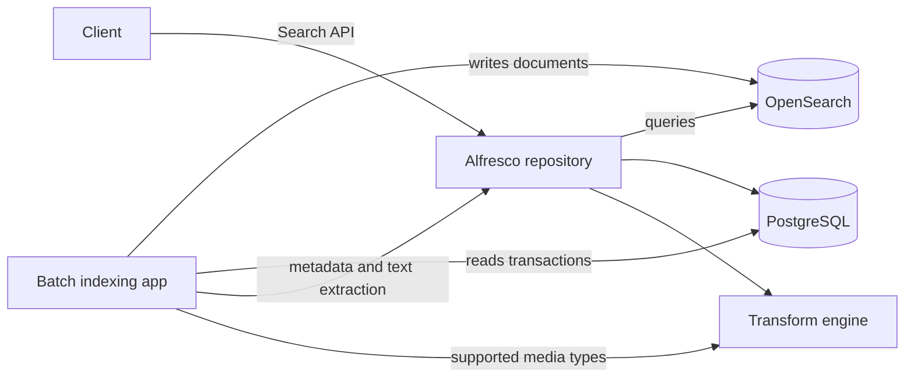

# How the search tier works

Reference for the design decisions and configuration properties behind the deployments in
this repository.

## Two services, not one

Alfresco Search Community splits into two pieces:

- **OpenSearch** holds the index. Alfresco talks to it over its REST API to run queries.
- **The batch indexing application** (`alfresco-elasticsearch-batch-indexing`) fills the
  index. It reads the repository's transaction table directly from the database, fetches
  metadata and extracted text from the repository, and writes documents into OpenSearch.

This differs from Solr 6, where the search service pulled from the repository's tracking API
and no separate indexer existed. Two consequences follow. The indexer needs its own database
credentials, and it needs to reach both the repository and the transform engine.

Reading nodes from the database has a third consequence that only shows up with a custom
content model. The database holds a property's namespace URI, not its prefix, while index field
names are built from the prefixed name, so the indexer resolves URI to prefix through a static
file that lists Alfresco's namespaces and no others. A model in an unlisted namespace is
indexed incompletely or not at all, silently. See
[custom-content-models.md](custom-content-models.md).



## Indexes in the cluster

Four index names are configured across the two services. Three of them are real:

| Index | Default name | Created by | Purpose |
| --- | --- | --- | --- |
| Main | `alfresco` | Repository, at startup | The searchable documents. Queried by Content Services. |
| State | `alfresco-reindex-state` | Indexer | The indexing cursor. Hidden. |
| Dead letter | `alfresco-reindex-dead-letter` | Indexer | Documents that failed to index. |
| Archive | `alfresco-archive` | Nothing | Nominally deleted nodes. Does not work, see below. |

The state index is hidden, so a plain listing leaves it out. Ask for hidden indexes to see all of
them:

```bash
curl -s "http://localhost:9200/_cat/indices?v&expand_wildcards=all"
```

### The archive index does not work. Do not use it

`elasticsearch.archive.indexName`, default `alfresco-archive`, is documented as the index used for
deleted (archived) nodes, which makes it look like an available option. It is not one.

Deleting a node in Alfresco does not erase it. The node moves from `workspace://SpacesStore` to
`archive://SpacesStore`, the store behind the trashcan, and the repository picks an index from the
store protocol of the request: `workspace` resolves to `elasticsearch.indexName`, `archive` to
`elasticsearch.archive.indexName`, and any other protocol throws
(`SearchRequestBuilderService.getElasticIndex()`). Through the v1 Search API you would reach the
second one by scoping a request to `deleted-nodes`.

That routing is all there is. **Nothing creates the archive index and nothing writes to it.** Three
separate parts of the product agree:

- The repository never writes to OpenSearch at all. Its indexer bean is a no-op
  (`ElasticsearchSearchServiceFactory.getIndexer()` returns `NoActionIndexer`, on the grounds that
  an external service does the indexing).
- `elasticsearch.createIndexIfNotExists` only ever covers the main index. `ElasticsearchInitialiser`
  and `ContentModelSynchronizer` work on `indexName` and never on the archive name.
- The batch indexer has no notion of it. Its image contains no reference to `alfresco-archive`, to
  `archive.indexName`, or to the archive store, only to the three indexes above.

So the property is a route to an index that no component provides, and a search scoped to
`deleted-nodes` fails rather than returning nothing. Nothing sets `ignore_unavailable`, and the
repository rethrows any search error that is not a highlighting error:

```
HTTP 500  Request failed: [index_not_found_exception] no such index [alfresco-archive]
```

**Do not try to fix this by creating the index by hand.** It would make the same request return
HTTP 200 with zero results, and that is worse than the error. An empty result set is
indistinguishable from "no deleted nodes matched", so a caller cannot tell a missing feature from a
genuine absence of hits. Silent wrong answers are already this subsystem's characteristic failure
mode, as the [Known limitation](#known-limitation) below describes. The 500 is the honest signal,
and the correct response to it is to stop scoping searches to deleted nodes on this subsystem.

None of these deployments creates the index, and none of them should.

Two related facts, both verified on 26.2.0:

- **Deletion is handled correctly on the main index.** A node moved to the trashcan is removed from
  `alfresco` within one indexing cycle, so trashcan content does not linger in ordinary search
  results. Nothing is leaking; the archive capability simply does not exist.
- **Solr 6 did index deleted nodes.** It is configured with a second core for
  `archive://SpacesStore` and populates it. Indexed access to deleted nodes is therefore a
  capability lost in the move to Alfresco Search Community, not merely one that is unconfigured.
  If anything in your deployment depends on it, settle that before migrating.

### Store scopes that do not map to a store

`scope.locations` also accepts `versions` and `history`, which the repository turns into
`workspace://version2Store` and `workspace://history`. Index selection switches on the protocol
alone and ignores the store identifier, so both resolve to the main `alfresco` index rather than
to anything version- or history-specific. A request scoped to `versions` reports the whole main
index in `totalItems` while returning no entries, because the results are filtered by store after
the count is taken. This belongs to the same family as the silent drops in
[Known limitation](#known-limitation) below.

## Selecting the subsystem

The repository chooses its search engine with one property:

```
index.subsystem.name=elasticsearch
```

The value stays `elasticsearch` for OpenSearch too. The alternative is `solr6`. Changing it
requires a repository restart because the subsystem is wired at startup. In a real
installation it lives in `alfresco-global.properties` or is set from the admin console; the
deployments here pin it in `JAVA_OPTS`, which is why the migration rollback needs a container
recreate rather than a property change.

## The shared secret is not optional

```
solr.secureComms=secret
solr.sharedSecret=<value>
```

This guards `/alfresco/service/api/solr/textContent`, the endpoint the batch indexer calls to
retrieve extracted text. It applies with OpenSearch exactly as it did with Solr, despite the
name. The value `none` is no longer supported in 26.2.

The indexer side of the same secret is `ALFRESCO_CONTENT_TRANSFORM_SHAREDSECRET`. If the two
disagree, indexing fails with authorization errors on text extraction while metadata-only
indexing appears to work, which makes the failure easy to misread.

Do not confuse any of this with OpenSearch's own security plugin. One protects an Alfresco
endpoint; the other protects OpenSearch. They are configured independently.

## The indexing cursor

The indexer tracks its position in a watermark document:

```
GET /alfresco-reindex-state/_doc/reindexByDate-watermark
```

The field that matters is `lastSuccessfulToTimeEpochMs`, a point in the timeline of
`alf_transaction.commit_time_ms`.

**On a first start with no cursor, the indexer begins at "now".** Content that already exists
is never indexed. For an empty repository this is harmless, which is why `minimal` ignores the
problem entirely. For a migration it is the whole problem, which is why
`solr-to-opensearch-migration` seeds the cursor before the indexer's first start.

Three properties govern catch-up:

| Property | Effect |
| --- | --- |
| `alfresco.reindex.continuous.maxGapAge` | Discards a cursor older than this. Set to `0` to disable the limit so a seeded cursor survives. Steady state is `24h`. |
| `alfresco.reindex.continuous.maxWindow` | How much of the timeline one cycle covers. Default `30m`. |
| `alfresco.reindex.continuous.catchUpPollingInterval` | Delay between catch-up cycles. |

### Seed from the database, not from a date

Catch-up walks the **calendar**, one `maxWindow` per cycle, not the documents. Seeding a fixed
early date on a young repository means grinding through years of empty windows at 30 minutes
each, with nothing to index.

Seeding at `MIN(commit_time_ms)` from `alf_transaction` puts the cursor at the repository's
first real transaction, so catch-up time is proportional to the history that actually exists.
For genuinely long histories, raise `maxWindow` to `7d` or more instead of lowering the poll
interval.

The cost is measurable. On a demo repository whose real history is minutes long, seeding at the
first transaction reaches the present in about a minute with the default `30m` window. Seeding
`2020-01-01` on the same repository takes roughly seven minutes even with `maxWindow=7d`,
advancing about 60 days of empty calendar per 10 seconds, and indexes exactly the same
documents at the end.

Seed with `_create` rather than `PUT`, so re-running the seeding step cannot restart a
migration already in progress.

## Keeping Solr current during a migration

The `elasticsearch` subsystem sets `search.solrTrackingSupport.enabled=false` by default, in
`subsystems/Search/elasticsearch/elasticsearch.properties`. That default is correct for a
finished migration and wrong for one in progress: it stops feeding Solr's tracking the moment
the repository switches subsystem, so Solr goes stale exactly when you want it as a rollback
target.

Force it to `true` for as long as you want rollback, and only then turn it off. It is read at
startup, so changing it means restarting the repository.

## Persistence is a correctness requirement

Alfresco content lives on the filesystem (`alf_data`) while its metadata lives in the
database. The two must stay in step. Recreating the repository container without a volume for
`alf_data` leaves a database full of references to content that no longer exists, and the
repository refuses to start with `CONTENT INTEGRITY ERROR`.

`minimal` and `minimal-tls` skip volumes deliberately: they are meant to be thrown away, and
every start is a clean one. `solr-to-opensearch-migration` needs them because phase 2 recreates
the Alfresco container. `full-stack` uses them because it is meant to be kept.

Use named volumes rather than bind mounts for database and index directories. On Docker
Desktop, bind-mounted host files carry the host user's uid while the service runs as a
different user inside the image, and PostgreSQL refuses to start on a data directory it does
not own (`data directory has wrong ownership`). Bind mounts remain fine for logs and for
read-only configuration.

## Hardening checklist

Nothing in this repository is production configuration. Before deploying anything like it:

- **Change every credential.** `SHARED_SECRET`, the database password, the OpenSearch
  password, and the Alfresco `admin` password are all weak and committed here.
- **Enable the OpenSearch security plugin.** Three of the four deployments disable it. Only
  `minimal-tls` shows it enabled, and even there the CA is self-signed and hostname
  verification is switched off.
- **Turn hostname verification back on.** Issue certificates whose SAN matches the hostname
  the repository connects to, then drop
  `elasticsearch.ssl.host.name.verification=false`.
- **Do not expose OpenSearch.** `minimal`, `minimal-tls` and the migration deployment publish
  port 9200 to the host for inspection. `full-stack` does not, which is the right default.
- **Re-enable CSRF protection.** Every deployment sets `csrf.filter.enabled=false` for
  convenience, and `full-stack` also sets `authentication.protection.enabled=false`, which
  disables brute-force protection.
- **Reconsider basic auth.** `alfresco.restApi.basicAuthScheme=true` is set to make `curl`
  examples short.
- **Size the JVM and the index deliberately.** The memory limits here are tuned to fit a
  laptop, not a workload.

## Known limitation

The official documentation states that range facets are supported. The product source
contradicts this: `ElasticsearchResultSet.getFacetRanges()` returns an empty map
unconditionally and `RangeParameters` is never consumed. Range facet requests are accepted and
return no facet data.

More generally, the `elasticsearch` subsystem **silently ignores** most query conditions it
cannot support, logging `Ignoring query condition because:` at WARN and dropping the condition
rather than failing the request. A query written to narrow results can therefore silently
broaden them. Check the indexer and repository logs when results look too generous.
