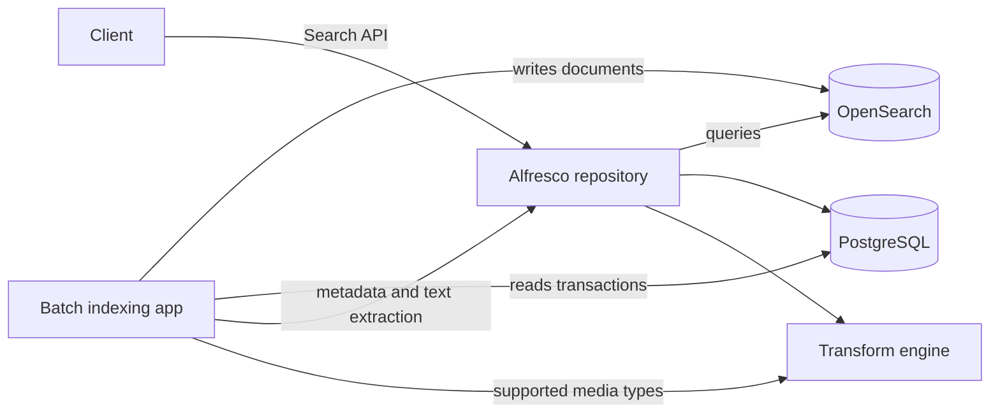

# How the search tier works

Reference for the design decisions and configuration properties behind the deployments in
this repository.

## Two services, not one

Alfresco Search Community splits into two pieces:

- **OpenSearch** holds the index. Alfresco talks to it over its REST API to run queries.
- **The batch indexing application** (`alfresco-elasticsearch-batch-indexing`) fills the
  index. It reads the repository's transaction table directly from the database, fetches
  metadata and extracted text from the repository, and writes documents into OpenSearch.

This differs from Solr 6, where the search service pulled from the repository's tracking API
and no separate indexer existed. Two consequences follow. The indexer needs its own database
credentials, and it needs to reach both the repository and the transform engine.



## Selecting the subsystem

The repository chooses its search engine with one property:

```
index.subsystem.name=elasticsearch
```

The value stays `elasticsearch` for OpenSearch too. The alternative is `solr6`. Changing it
requires a repository restart because the subsystem is wired at startup. In a real
installation it lives in `alfresco-global.properties` or is set from the admin console; the
deployments here pin it in `JAVA_OPTS`, which is why the migration rollback needs a container
recreate rather than a property change.

## The shared secret is not optional

```
solr.secureComms=secret
solr.sharedSecret=<value>
```

This guards `/alfresco/service/api/solr/textContent`, the endpoint the batch indexer calls to
retrieve extracted text. It applies with OpenSearch exactly as it did with Solr, despite the
name. The value `none` is no longer supported in 26.2.

The indexer side of the same secret is `ALFRESCO_CONTENT_TRANSFORM_SHAREDSECRET`. If the two
disagree, indexing fails with authorization errors on text extraction while metadata-only
indexing appears to work, which makes the failure easy to misread.

Do not confuse any of this with OpenSearch's own security plugin. One protects an Alfresco
endpoint; the other protects OpenSearch. They are configured independently.

## The indexing cursor

The indexer tracks its position in a watermark document:

```
GET /alfresco-reindex-state/_doc/reindexByDate-watermark
```

The field that matters is `lastSuccessfulToTimeEpochMs`, a point in the timeline of
`alf_transaction.commit_time_ms`.

**On a first start with no cursor, the indexer begins at "now".** Content that already exists
is never indexed. For an empty repository this is harmless, which is why `minimal` ignores the
problem entirely. For a migration it is the whole problem, which is why
`solr-to-opensearch-migration` seeds the cursor before the indexer's first start.

Three properties govern catch-up:

| Property | Effect |
| --- | --- |
| `alfresco.reindex.continuous.maxGapAge` | Discards a cursor older than this. Set to `0` to disable the limit so a seeded cursor survives. Steady state is `24h`. |
| `alfresco.reindex.continuous.maxWindow` | How much of the timeline one cycle covers. Default `30m`. |
| `alfresco.reindex.continuous.catchUpPollingInterval` | Delay between catch-up cycles. |

### Seed from the database, not from a date

Catch-up walks the **calendar**, one `maxWindow` per cycle, not the documents. Seeding a fixed
early date on a young repository means grinding through years of empty windows at 30 minutes
each, with nothing to index.

Seeding at `MIN(commit_time_ms)` from `alf_transaction` puts the cursor at the repository's
first real transaction, so catch-up time is proportional to the history that actually exists.
For genuinely long histories, raise `maxWindow` to `7d` or more instead of lowering the poll
interval.

Seed with `_create` rather than `PUT`, so re-running the seeding step cannot restart a
migration already in progress.

## Keeping Solr current during a migration

The `elasticsearch` subsystem sets `search.solrTrackingSupport.enabled=false` by default, in
`subsystems/Search/elasticsearch/elasticsearch.properties`. That default is correct for a
finished migration and wrong for one in progress: it stops feeding Solr's tracking the moment
the repository switches subsystem, so Solr goes stale exactly when you want it as a rollback
target.

Force it to `true` for as long as you want rollback, and only then turn it off. It is read at
startup, so changing it means restarting the repository.

## Persistence is a correctness requirement

Alfresco content lives on the filesystem (`alf_data`) while its metadata lives in the
database. The two must stay in step. Recreating the repository container without a volume for
`alf_data` leaves a database full of references to content that no longer exists, and the
repository refuses to start with `CONTENT INTEGRITY ERROR`.

`minimal` and `minimal-tls` skip volumes deliberately: they are meant to be thrown away, and
every start is a clean one. `solr-to-opensearch-migration` needs them because phase 2 recreates
the Alfresco container. `full-stack` uses bind mounts under `./data` so the state is visible.

## Hardening checklist

Nothing in this repository is production configuration. Before deploying anything like it:

- **Change every credential.** `SHARED_SECRET`, the database password, the OpenSearch
  password, and the Alfresco `admin` password are all weak and committed here.
- **Enable the OpenSearch security plugin.** Three of the four deployments disable it. Only
  `minimal-tls` shows it enabled, and even there the CA is self-signed and hostname
  verification is switched off.
- **Turn hostname verification back on.** Issue certificates whose SAN matches the hostname
  the repository connects to, then drop
  `elasticsearch.ssl.host.name.verification=false`.
- **Do not expose OpenSearch.** `minimal`, `minimal-tls` and the migration deployment publish
  port 9200 to the host for inspection. `full-stack` does not, which is the right default.
- **Re-enable CSRF protection.** Every deployment sets `csrf.filter.enabled=false` for
  convenience, and `full-stack` also sets `authentication.protection.enabled=false`, which
  disables brute-force protection.
- **Reconsider basic auth.** `alfresco.restApi.basicAuthScheme=true` is set to make `curl`
  examples short.
- **Size the JVM and the index deliberately.** The memory limits here are tuned to fit a
  laptop, not a workload.

## Known limitation

The official documentation states that range facets are supported. The product source
contradicts this: `ElasticsearchResultSet.getFacetRanges()` returns an empty map
unconditionally and `RangeParameters` is never consumed. Range facet requests are accepted and
return no facet data.

More generally, the `elasticsearch` subsystem **silently ignores** most query conditions it
cannot support, logging `Ignoring query condition because:` at WARN and dropping the condition
rather than failing the request. A query written to narrow results can therefore silently
broaden them. Check the indexer and repository logs when results look too generous.
